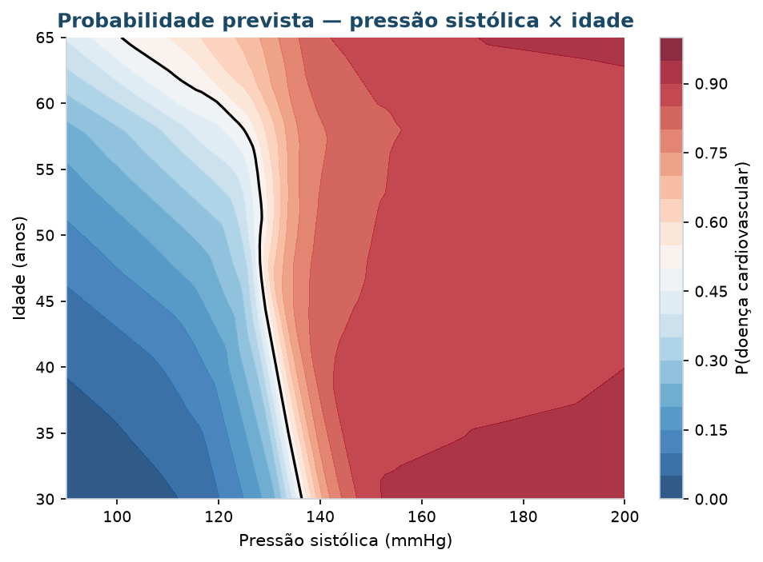

# Coração de Dados — Redes Neurais

Redes neurais (deep learning) para **prever doença cardiovascular** a partir do perfil
clínico do paciente. É o projeto irmão do CoracaoDadoTema6, que segmentava os mesmos
pacientes sem usar o diagnóstico. Aqui o problema passa a ser **supervisionado**: a rede
aprende o alvo `cardio` e apoia a **triagem**, indicando quem deve ser priorizado para
investigação.



## Dados

Base curada herdada do Tema 6 (`data/processed/cardio_curado.csv`): **68.551 pacientes**
do *Cardiovascular Disease dataset* (Kaggle, sulianova), já sem duplicatas nem registros
fisiologicamente implausíveis. A base bruta segue em `data/raw/` para referência.

| Grupo | Variáveis | Tratamento |
|:--|:--|:--|
| Contínuas | idade, altura, peso, **IMC** (derivado), pressão sistólica e diastólica | padronização |
| Ordinais | colesterol, glicose (1–3) | one-hot |
| Binárias | sexo masculino (derivado), fumo, álcool, atividade física | 0/1 |

São 16 entradas para a rede. A divisão é estratificada em 60 % treino, 20 % validação e
20 % teste, e o pré-processador é ajustado **somente no treino**. As classes estão
equilibradas (49,5 % com doença).

## Roteiro

Os notebooks seguem a progressão da disciplina: do neurônio que aprende a soma até
Transformers e um agente com LLM.

| Notebook | O que faz |
|:---|:---|
| `01-mlp-do-zero-numpy` | Neurônio que aprende a soma; neurônio sigmoide com 2 variáveis; MLP com backpropagation escrito à mão (He, mini-lotes, L2, parada antecipada); verificação numérica do gradiente; efeito da taxa de aprendizado |
| `02-mlp-keras` | MLP em Keras com Dropout, EarlyStopping pela AUC, class_weight e escolha do **limiar de triagem** na validação |
| `03-mlp-pytorch` | A mesma rede em PyTorch, com o laço de treino explícito |
| `04-otimizadores-arquiteturas` | SGD, momentum, RMSprop, Adam, AdamW e Nadam; profundidade, largura, Dropout, BatchNorm; superfície de decisão 2D; **busca de hiperparâmetros com Keras Tuner** (Hyperband, 90 redes); **agendas da taxa de aprendizado** |
| `05-comparacao-modelo-final` | Redes × regressão logística × Gradient Boosting no mesmo teste, com IC 95 % por bootstrap e diferenças pareadas; **calibração** das probabilidades; treina e salva o modelo final |
| `06-explicabilidade` | Importância por permutação, SHAP (beeswarm, dependência, pacientes individuais) e LIME |
| `07-transformer-tabular` | **Transformer** com cada variável como token: embeddings, atenção múltipla (Query/Key/Value), token `[CLS]`; mapas de atenção comparados com a permutação |
| `08-autoencoder` | **Autoencoder** (não supervisionado): mapa latente 2D × PCA, espaço latente como atributos, registros atípicos pelo erro de reconstrução |
| `09-agente` | **Agente ReAct** (LangChain + OpenAI) que usa a rede como ferramenta: extrai os dados de texto livre, converte a pressão em código, chama a rede e explica o resultado |

### Relação com os conteúdos da disciplina

| Conteúdo (slides) | Onde está |
|:--|:--|
| Neurônio, funções de ativação, entropia cruzada, backpropagation | 01 |
| Keras / TensorFlow: `Sequential`, `compile`, `fit`, curvas de perda e acurácia, salvar e carregar | 02, 05 |
| PyTorch | 03 |
| Otimizadores, taxa de aprendizado, regularização (Dropout, L2, BatchNorm) | 01, 02, 04 |
| Explicabilidade (SHAP, LIME) | 06 |
| Transformers: atenção, Query/Key/Value, atenção múltipla, embeddings | 07 |
| Redes generativas / aprendizado não supervisionado com redes | 08 (autoencoder) |
| LangChain: agentes ReAct, ferramentas, RAG, Streamlit | 09 e aba "Assistente" do app |
| Redes convolucionais, transfer learning, RNN/LSTM | **não aplicável** (ver Limitações) |

Figuras e tabelas de cada notebook ficam em `reports/figures/<notebook>/` e
`reports/tables/<notebook>/` (CSV com `;` e decimal `,`).

## Resultados principais

**Teste — 13.711 pacientes nunca vistos**, com limiar escolhido na validação para
sensibilidade ≥ 80 %:

| Modelo | AUC | IC 95 % | Sensibilidade | Especificidade |
|:--|:-:|:-:|:-:|:-:|
| Gradient Boosting | 0,803 | 0,795–0,810 | 81,2 % | 63,0 % |
| MLP PyTorch | 0,802 | 0,795–0,809 | 81,1 % | 63,0 % |
| MLP Keras (modelo final) | 0,801 | 0,794–0,808 | 80,8 % | 62,9 % |
| Transformer tabular (notebook 07) | 0,801 | — | 81,1 % | 62,2 % |
| MLP NumPy (do zero) | 0,801 | 0,793–0,808 | 81,1 % | 62,4 % |
| Regressão logística | 0,794 | 0,787–0,801 | 80,4 % | 62,4 % |

* **Redes e Gradient Boosting ficam a no máximo ≈ 0,002 de AUC uns dos outros**, e isso
  vale também para o Transformer (18 mil parâmetros). Com 13.711 pacientes, o bootstrap
  pareado detecta diferenças de 0,001, mas qual par cruza a significância muda a cada
  execução: é significância estatística sem relevância prática. O teto (~0,80) vem da
  informação disponível (16 variáveis tabulares, rótulos ruidosos), não do modelo: redes de
  289 a 48 mil parâmetros e a melhor de 90 configurações do Keras Tuner ficam no mesmo
  lugar. A regressão logística fica atrás por ≈ 0,008, uma diferença significativa em todas as
  execuções.
* **As probabilidades são confiáveis:** as redes estão bem calibradas (erro médio de 1–2
  pontos percentuais), então "risco de 70 %" pode ser lido como frequência real.
* **O limiar importa mais que a arquitetura.** Com limiar 0,5, a rede final encontra 71 %
  dos doentes; no limiar de triagem (0,38), encontra 81 %, ao custo de a especificidade
  cair de 77 % para 63 %.
* **A pressão sistólica domina** (permutação, SHAP e LIME concordam), seguida de idade e
  colesterol. Sozinha, a rede chegou a uma fronteira de 130–135 mmHg, perto do limiar
  clínico de hipertensão.
* **Paradoxo de fumo e álcool:** o modelo associa esses hábitos autodeclarados a um risco
  *menor*. É um artefato conhecido desta base, não um efeito protetor — e é o tipo de
  achado que a etapa de explicabilidade existe para expor.
* **O autoencoder, sem ver o diagnóstico,** organizou os pacientes por pressão, idade e
  tamanho corporal, a mesma hierarquia das redes supervisionadas. Seu erro de reconstrução
  aponta registros suspeitos (pressão de pulso de 100 a 140 mmHg, como 190/60) que os
  filtros de faixa da curadoria deixaram passar.

> TensorFlow e PyTorch não são totalmente determinísticos na CPU: ao reexecutar, as
> métricas variam na terceira casa decimal, sem mudar nenhuma das conclusões.

## Aplicação

`src/deployment/app.py`, com três partes:

* **Paciente** — formulário que devolve a probabilidade prevista, a decisão de triagem e
  quatro gráficos interativos: a curva "e se a pressão sistólica fosse outra?" (com a
  pressão em que o limiar é cruzado), a posição do paciente entre os 13.711 pacientes de
  teste, os fatores que mais pesaram e o paciente no mapa pressão × idade;
* **Assistente (agente)** — chat em que a pessoa descreve o paciente em texto livre; o
  agente (LangChain + OpenAI) extrai os dados, pergunta o que faltar, chama a rede e mostra
  cada chamada de ferramenta. Requer `OPENAI_API_KEY`;
* **Desempenho do modelo** — controle deslizante do limiar que atualiza a matriz de
  confusão e as curvas de sensibilidade/especificidade, diagrama de calibração, AUC dos
  modelos com intervalo de confiança e importância das variáveis.

Os gráficos são feitos com Altair (`src/deployment/graficos_app.py`) e testados sem abrir a
aplicação.

### Configurando o agente

```bash
cp .env.exemplo .env         # e preencha OPENAI_API_KEY (o .env não vai para o git)
uv run invoke agente         # conversa no terminal
uv run invoke app            # ou pela aba "Assistente" da aplicação
```

O LLM não calcula risco: todo número vem da rede neural, por meio da ferramenta
`avaliar_paciente` (`src/agente/ferramentas.py`). Os testes exercitam o ciclo completo com
um LLM roteirizado, sem chamar a API.

## Limitações

* **Redes convolucionais, transfer learning e RNN/LSTM não foram usadas** porque a base não
  tem imagens nem séries temporais: cada paciente é uma linha com 12 variáveis medidas uma
  vez. Forçar uma convolução ou uma LSTM sobre essas colunas seria artificial (a ordem das
  colunas não tem significado). Se a organização passar a registrar ECG, exames de imagem
  ou medições de pressão ao longo do tempo, essas arquiteturas passam a fazer sentido.
* Colesterol e glicose vêm em só 3 níveis; fumo, álcool e atividade são autodeclarados.
* Treinado em adultos de 30 a 65 anos; fora disso, a previsão é extrapolação (o agente
  avisa).

## Utilização

Usa o [uv](https://docs.astral.sh/uv/) para dependências e ambiente (Python 3.12).

```bash
uv sync                      # cria o ambiente e instala tudo (TensorFlow, PyTorch, SHAP…)
uv run invoke --list         # lista as tarefas

uv run invoke treinar        # treina a rede final e grava models/
uv run invoke app            # abre a aplicação Streamlit
uv run invoke notebooks      # executa os 9 notebooks em ordem (~15 min num Mac M-series)
uv run invoke agente         # conversa com o agente no terminal (requer OPENAI_API_KEY)
uv run invoke lab            # JupyterLab
uv run invoke test           # pytest
uv run invoke lint           # ruff
```

Os notebooks também rodam no Google Colab com o repositório clonado: a primeira célula de
cada um acrescenta a raiz do projeto ao `sys.path`.

## Organização

```
.
├── data/
│   ├── processed/          # cardio_curado.csv (herdado do Tema 6), dicionário, manifesto
│   └── raw/                # cardio_train.csv original
├── models/                 # mlp_cardio.keras, preprocessador.joblib, metadados.json
├── notebooks/              # 01 a 09 — ver Roteiro
├── reports/                # figuras e tabelas geradas pelos notebooks
├── src/
│   ├── config.py           # caminhos, variáveis, semente, protocolo, paleta
│   ├── data/dados.py       # carga, variáveis derivadas, divisão 60/20/20, pré-processador
│   ├── model/
│   │   ├── mlp_numpy.py    # MLP do zero (forward, backprop, He, L2, early stopping)
│   │   ├── mlp_keras.py    # construtor e treino em Keras, otimizadores
│   │   ├── mlp_torch.py    # CardioNet e laço de treino em PyTorch
│   │   ├── transformer_tabular.py  # Transformer com variáveis como tokens
│   │   ├── autoencoder.py  # autoencoder denso e erro de reconstrução
│   │   ├── avaliacao.py    # métricas, limiar, bootstrap pareado, explicação por oclusão
│   │   └── treino.py       # treino e persistência do modelo final
│   ├── agente/             # agente ReAct (LangChain + OpenAI) e suas ferramentas
│   ├── utils/              # gravação de figuras/tabelas e gráficos comuns
│   └── deployment/app.py   # aplicação Streamlit
├── tests/                  # pytest: dados, gradiente, redes, limiar, bootstrap, oclusão, agente, app
├── pyproject.toml / uv.lock
└── tasks.py                # tarefas do invoke
```

## Referências

Exercícios da disciplina usados como base: rede neural da soma, MLP do zero no EEG
(inicialização He, L2), redes Keras no câncer de mama e no crédito alemão (Dropout,
EarlyStopping, class_weight, limiar), Iris em PyTorch, vinhos com superfície de decisão em
PCA, comparação de otimizadores no CIFAR-10 e XAI com SHAP/LIME
([naubergois/Exercicios](https://github.com/naubergois/Exercicios)). Slides da disciplina
(Deep Learning, Transformers, LangChain e agentes) como guia dos notebooks 07 a 09.

Gorishniy et al. (2021), *Revisiting Deep Learning Models for Tabular Data* (FT-Transformer).
Jain & Wallace (2019), *Attention is not Explanation*.
